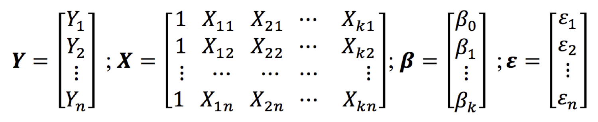
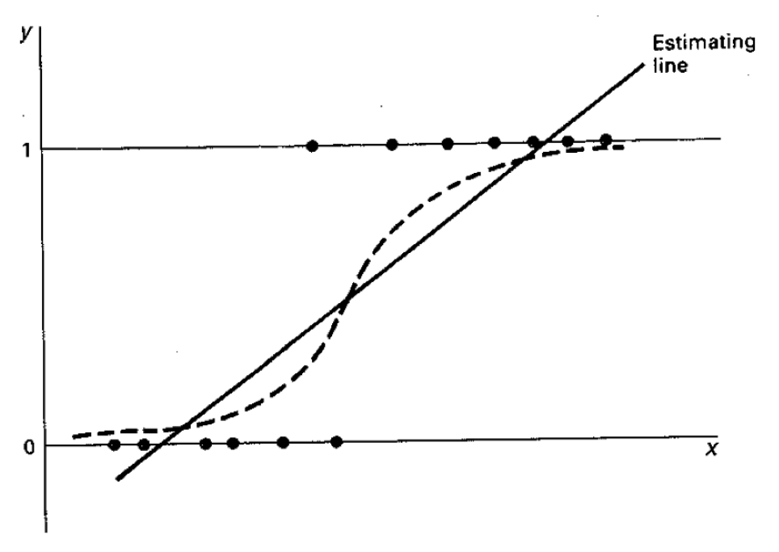
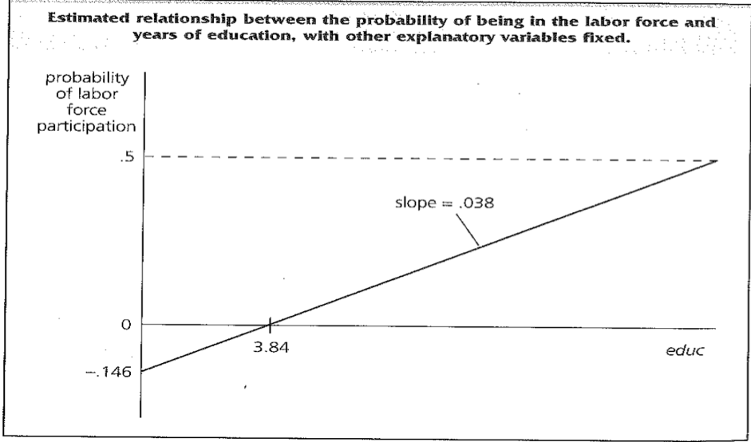

# 1. Introduction

Nous commencerons par décrire les méthodes d'apprentissage supervisé, puis nous passerons aux méthodes d'apprentissage non supervisé. Nous nous concentrons ici sur l'intuition derrière les méthodes et l'algorithme, ainsi que sur quelques conseils pratiques, plutôt que sur la théorie statistique qui sous-tend les méthodes. Nous encourageons les lecteurs à se référer aux livres sur l'apprentissage automatique listés dans la section Ressources. La boîte Vocabulaire donne des définitions succinctes de plusieurs termes que nous utiliserons dans cette section.


# 2. Apprentissage supervisé 

Nous abordons maintenant le problème de l'apprentissage supervisé, qui implique généralement des méthodes de **classification**, de **prédiction** et de **régression**. Nous nous concentrerons principalement sur les méthodes de classification dans ce chapitre, car bon nombre des méthodes de régression en apprentissage automatique sont assez similaires aux méthodes que vous connaissez déjà. Rappelez-vous que la classification signifie prédire une variable discrète (ou catégorielle). La plupart des méthodes de classification que nous aborderons peuvent également être utilisées pour la régression (prédire des résultats continus).

En général, les méthodes d'apprentissage supervisé prennent en entrée des paires de points de données $(X,Y)$ où $X$ représente les variables prédictives (caractéristiques) et $Y$ est la variable cible (étiquette). La méthode d'apprentissage supervisé utilise ensuite ces paires comme données d'entraînement et apprend un modèle $F$, où $F(X)\sim Y$. Ce modèle $F$ est ensuite utilisé pour prédire les $Y$ pour de nouveaux points de données $X$. Comme mentionné précédemment, l'objectif n'est pas de construire un modèle qui s'adapte le mieux aux données connues, mais un modèle utile pour les prédictions futures et qui **minimise l'erreur de généralisation future**. C'est le but principal qui différencie bon nombre des méthodes que vous connaissez des méthodes que nous décrirons ensuite. Pour minimiser l'erreur future, nous voulons construire des modèles qui ne **sur-apprennent** pas simplement les données passées.

Un autre objectif, souvent priorisé dans les sciences sociales, que les méthodes d'apprentissage automatique n'optimisent pas, est d'obtenir une forme structurelle du modèle. Les modèles d'apprentissage automatique pour la classification peuvent prendre différentes formes structurelles (allant de modèles linéaires, à des ensembles de règles, à des formes non linéaires plus complexes), et il n'est pas toujours possible de les écrire sous une forme compacte comme une équation. Cela ne les rend cependant pas **incompréhensibles ou ininterprétables**. 

Un autre axe de concentration des modèles d'apprentissage automatique pour l'apprentissage supervisé est la **prédiction**, et pas nécessairement l'inférence causale <!-- ^[Le sujet de l'inférence causale est abordé plus en détail dans le chapitre Qualité des données et erreurs d'inférence.] -->. Certains de ces modèles peuvent être utilisés pour aider à l'inférence causale, mais ils sont généralement optimisés pour les tâches de prédiction. Nous croyons qu'il existe de nombreux problèmes de sciences sociales et de politique où de meilleures méthodes de prédiction peuvent être extrêmement bénéfiques [@Kleinberg2015]. 

Dans ce chapitre, nous traitons principalement des problèmes de classification binaire : c'est-à-dire des problèmes où les points de données doivent être classés dans l'une des deux catégories. Plusieurs des méthodes que nous aborderons peuvent également être utilisées pour la classification multiclasses (classer un point de données dans l'une des $n$ catégories) ou pour la classification multi-étiquette (classer un point de données dans $m$ des $n$ catégories où $m \ge 1$). Il existe également des approches pour transformer des problèmes multiclasses en un ensemble de problèmes binaires que nous mentionnerons brièvement dans la section suivante.

Avant de décrire les méthodes d'apprentissage supervisé, nous voulons récapituler quelques principes ainsi que des termes que nous avons utilisés et que nous utiliserons dans le reste du chapitre.

**1. Entraîner un modèle**

Une fois que nous avons terminé l'exploration des données, **rempli les valeurs manquantes**, **créé des variables prédictives (caractéristiques)** et **décidé quelle est notre variable cible (étiquette)**, nous avons maintenant des paires de $X,Y$ pour commencer **à entraîner** (ou construire) le modèle.

**2. Utiliser le modèle pour évaluer de nouvelles données**

Nous construisons ce modèle afin de pouvoir prédire $Y$ pour **un nouvel ensemble** de $X$s — utiliser le modèle signifie obtenir de nouvelles données, générer les mêmes caractéristiques pour obtenir le vecteur $X$, puis appliquer le modèle pour produire $Y$.


## 2.1. Les méthodes de régression

### 2.1.1  Régression linéaire simple

#### 2.1.1.1. Définition

- Le modèle de **régression linéaire simple** peut être utilisé pour étudier la relation entre deux variables, la variable dépendante (Y) et la variable indépendante (X), comme l'exemple dont nous venons de parler.
- On parle de **régression linéaire multiple** dans le cas où il y a au moins 2 **variables indépendantes**.

#### 2.1.1.2. Spécification

- Nous avons {Yi, Xi}, un échantillon de Y et X
- Nous sommes intéressés à **"expliquer Y en termes de X"** ou à **"étudier comment Y varie avec les changements de X"**
- Modèle

$$ Y = \alpha + \beta X + \epsilon $$
 
  - Y = variable dépendante | variable à expliquer
 
  - X = variable indépendante | variable explicative | prédicteur
 
  - ($\alpha$, $\beta$) = coefficients à déterminer (on dit à estimer) | paramètres du modèle
 
  - $\epsilon$ = erreurs| termes d'erreur de moyenne nulle (unobserved error / disturbance error )


#### 2.1.1.3. Interprétation

$$ Y = \alpha + \beta X + \epsilon $$
ou une formulation alternative:

$$ E(Y|X) = \alpha + \beta X $$

- $\alpha + \beta X$ : moyenne de Y étant donnée la valeur de X 
- $\alpha$ : la valeur de Y quand X est zéro
- $\beta$ : augmentation de Y associée à une augmentation d'une unité de X

#### 2.1.1.4. D'où vient le epsilon

1. Omission de l'influence d'innombrables événements fortuits
    - Autres covariables importantes (influences systématiques)
      Etat nutritionnel de la mère
    - Autres petites variables non significatives avec une très légère influence irrégulière

2. Erreur de mesure
    - Dans la variable dépendante
    - Dans la variable indépendante (plus problématique)

3. Indétermination humaine

    - Le comportement humain est tel que les actions entreprises dans des circonstances identiques différeront de manière aléatoire

#### 2.1.1.5. Spécification

```{r rline, echo=FALSE, fig.cap="", out.width = '100%'}
knitr::include_graphics("../Images/regression_line.png")
```

- $\beta_{0}$ = intersection à l'origine (intercept)
- $\beta_{1}$ = pente (slope) 


#### 2.1.1.6. Méthodes d'estimation

- Il existe de nombreux estimateurs présentant des caractéristiques différentes susceptibles de résoudre l'équation 1. 

- La tâche de l'économètre est de trouver le meilleur **estimateur**. 

- Les deux approches les plus importantes sont:

    1. Méthodes des moindres carrés: dans le cas d'une régression linéaire simple, il s'agit de trouver la meilleure ligne qui décrit de manière appropriée le nuage de points {Yi, Xi}.

    2. Approche du maximum de vraisemblance


**- Méthode d'estimation: moindres carrées ordinaires**

- Estimer les paramètres du modèle à partir des données {$X_i, Y_i$}
- ($\hat{\alpha}, \hat{\beta}$) : Coefficients estimés
- $\hat{Y} = \hat{\alpha} +  \hat{\beta} X$ : Valeur prédite (predicted/fitted value)
- $\hat{\
epsilon} = Y - \hat{Y}$ : Résidus (residuals)

- Minimiser la somme des carrées des résidus (SSR) : $$ SSR = \sum_{i=1}^n\hat{\epsilon}^2  = \sum_{i=1}^n(Y_i - \hat{\alpha} +  \hat{\beta X_i})^2 $$
- Solution
- Coefficients estimés : $$\hat{\alpha} = \bar{Y} -  \hat{\beta} \bar{X}$$

$$\hat{\beta} = \frac{\sum_{i=1}^n(Y_i - \bar{Y})(X_i - \bar{X})}{\sum_{i=1}^n(X_i - \bar{X})^2}$$

- la droite des moindres carrées passe toujours par les points ($\bar{X}, \bar{Y}$)
- $\hat{Y} = \bar{Y}$
- la moyenne des résidus est toujours égale à zéro


### 2.1.2. Régression linéaire multiple

#### 2.1.2.1. Introduction

- La régression linéaire simple ne permet pas de déduire une causalité: la réalité est plus complexe
- Permet de comprendre le concept de régression
- En cas de plus d'une variable indépendante, on parle de régression linéaire multiple

#### 2.1.2.2. Spécification

$$ Y_i = \alpha + \beta_1 X_{1i} +  \beta_2 X_{2i} + ...+\beta_k X_{ki} +\epsilon_i$$
Où $\epsilon_i$ suit une loi normale de moyenne 0 et de variance $\sigma^2$. On a k indépendantes variables pour n observations ${(Y_i, X_{11}, X_{12}, ..., X_{1k}), ..., (Y_n, X_{n1}, X_{n2}, ..., X_{nk})}$.

Exemple:
  - Y peut être le poids à la naissance
  - X1 l'age de la mère à la naissance de l'enfant
  - X2 le sexe de l'enfant


$$ Y_i = \alpha + \beta_1 X_{1i} +  \beta_2 X_{2i} + ...+\beta_k X_{ki} +\epsilon_i$$

- Votre tâche: estimer l’effet de chaque variable X spécifique sur Y, en contrôlant l’effet des autres.
- Cette équation peut être récrite :

$Y_1 = \alpha + \beta_1 X_{11} + \beta_2 X_{21} + ... + \beta_k X_{k1} + \epsilon_1$
$Y_2 = \alpha + \beta_1 X_{12} + \beta_2 X_{22} + ... + \beta_k X_{k2} + \epsilon_2$
...
$Y_n = \alpha + \beta_1 X_{1n} + \beta_2 X_{2n} + ... + \beta_k X_{kn} + \epsilon_n$

Cette façon d’écrire les équations est difficile à manipuler:

Notation matricielle: $Y = X\beta + \epsilon$





#### 2.1.2.3. Estimation des paramètres

**1. Hypothèses**


```{r, out.width="80%"}
knitr::include_graphics("../Images/hypotheses_regression.png")
```


- Les paramètres inconnus:
  - k (beta) + 1 (alpha) paramètres
  - $\sigma^2$

- Estimation par les moindres carrés ordinaires ou la méthode des maximums de vraisemblance: Plus difficile à estimer.


**2. Estimation**

- On démontre que :

$\beta^* = (X^{'}X)^{-1}(X^{'}Y)$

Variance-covariance de $\beta^* = \sigma^2(X^{'}X)^{-1}$

Mais encore une fois, $\sigma^2$ n'est pas connu. Il est remplacé par:

$s^2 = e^{'}e/(T-k)$

avec (e = Y-Y')


#### 2.1.2.4. Évaluation des performances

RMSE, MAE, R²


### 2.1.3. Les méthodes de régularisation


#### 2.1.3.1. Introduction : pourquoi la régularisation ?


- Les moodèles de regresssion classique peuvent souvent conduire à un surajustement(overfitting)
- Le surapprentissage peut être causé par la présence de variables inutiles ou redondadantes, ou par une quantitité insuffisante de donnée d'entrainement.
- Les modèles pénalisés, sont des techniques de régularisation qui permettent de limiter le surajustement en ajoutant des termes de pénalité à la fonction de coût de la régression. 

- Les termes de pénalité encouragent le modèle à avoir des coefficients plus petits, ce qui reduit la complexité du modèle et limite l'influence des variables inutiles ou redondantes. 

- Les modèles pénalisés permettent également de sélectionner automatiquement les variables les plus importantes, ce qui peut améliorer la compréhension du modèle et la qualité des prédictions. 

- Les modèles pénalisés sont particulièrement utiles lorsque le nombre de variables indépendantes est élevé ou lorsque les données d"entrainement sont limitées. 

- En resumé, les modèles pénalisés sont une technique importante pour limiter l'overffiting et améliorer la généralisation des modèles de régression

#### 2.1.3.2. Types de régularisation

- Régression ridge
- Régression Lasso
- Régression Elastic Net

#### 2.1.3.2.1. Régression Ridge ou L2

**1. Principe de la régularisation L2**

- La régression Ridge ajoute une pénalité L2 à la fonction de coût
- La pénalité L2 ajoute une contrainte sur les coefficients de régression, en les limitants à des valeurs proche de Zéro
- Ridge permet de réduire la variance du modèle et améliorer la capacité à généraliser


**2. Fonction de coût**

$$
\sum_{i=1}^n{(Y_i - X\beta|_i)^2}+ \lambda \sum_{j=1}^p \beta_j^2, 0 \leq \lambda \leq 1.
$$

- Faire une régression Ridge c'est donc résoudre le problème d'optimisation suivant :

$$
\text{Minimiser} \sum_{i=1}^n{(Y_i - X\beta|_i)^2} \text{sous la contrainte} \sum_{j=1}^p \beta_j^2 \leq s
$$


#### 2.1.3.2.2. Régression Lasso OU L1

**1. Principe de la régularisation L1**

- La régression Lasso ajoute une pénalité L1 à la fonction de coût de la régression. 
- La pénalité L1 impose une contrainte plus forte sur les coefficients de régression, *en les poussant à zéro pour  certains coefficients.*
- Cette méthode permet de selectionner automatiquement les variables les plus importantes et de réduire la dimensionnalité du modèle. 

**2. Fonction de coût**

$$
\sum_{i=1}^n{(Y_i - X\beta|_i)^2}+ \lambda \sum_{j=1}^p |\beta_j|, 0 \leq \lambda \leq 1.
$$

- Faire une régression Lasso c'est donc résoudre le problème d'optimisation suivant :

$$
\text{Minimiser} \sum_{i=1}^n{(Y_i - X\beta|_i)^2} \text{sous la contrainte} \sum_{j=1}^p |\beta_j| \leq s
$$

#### 2.1.3.2.3. Régression Elastic Net

- Elastic Net est une Combinaison de la régularisation L1 et L2

- Sa fonction de coût est : 

$$
 \sum_{i=1}^n{(Y_i - X\beta|_i)^2}+ (1 - \alpha) ( \sum_{j=1}^p \ \beta_j^2 )  + (\alpha) ( \lambda \sum_{j=1}^p \ |\beta_j|  )
$$

- Cette méthode permet de combiner les avantages de la régression Ridge et Lasso, en *réduisant la variance du modèle et en sélectionnant les variables les plus importantes.*
- Avantages par rapport aux autres méthodes

### 2.1.4. Méthodes d'estimation

- Méthode des moindres carrés
- Méthode de descente de gradient


### 2.1.5. Comparaison des méthodes

- Forces et faiblesses de chaque méthode
- Choix en fonction du contexte


### 2.1.6. Conclusion

- Avantages des régressions régularisées
- Utilisation dans différents domaines


### 2.1.7. Ressources supplémentaires pour approfondir le sujet

- <https://glmnet.stanford.edu/articles/glmnet.html>

- <https://github.com/Labo-Lacourse/Code_chap_23_logistic_regression_regularization>

### 2.1.8. Exemple pratique

- Application des régressions régularisées sur un jeu de données
- Comparaison des résultats avec la régression classique


## 2.2 La régression logistique

Une technique courante pour l'apprentissage supervisé est la régression logistique, une méthode avec laquelle vous êtes déjà familier. 

### 2.2.1. Introduction

- La variable dépendante dichotomique est un cas particulier de variable dépendante qualitative où la variable dépendante n'a que deux catégories
  - Succès / perte, malade ou non, entrée dans la sexualité ou non
- Variable dépendante qualitative

- L'analyse de régression d'une variable qualitative binaire ou dichotomique est un problème courant en sociologie
- Ces modèles se concentrent sur les déterminants de la probabilité p d'occurrence d'un résultat plutôt que d'un autre résultat qui se produit avec une probabilité de 1-p.
- Exemples:
   - Modéliser si le premier rapport sexuel a eu lieu pendant l'adolescence ou non
   - Modéliser si une personne a utilisé une méthode de contraception moderne ou pas
   - Donnez-moi d'autres exemples

### 2.2.2. Estimation

- Dans l'analyse de régression, nous voulons mesurer comment la probabilité p varie d'un individu à l'autre en fonction des régresseurs (variables indépendantes0.

- Trois principales approches d'estimation sont utilisées:
  1. Le modèle de probabilité linéaire
  - Souvent dans le cas d'un régresseur endogène
  2. Le modèle logit
  3. le modèle probit

#### 2.2.2.1. Le modèle de probabilité linéaire

>- $Y_i = \beta_0 + \beta_1X_i + ... + \beta_kX_k + \epsilon+j$

>- Parce que Y ne peut prendre que deux valeurs, $\beta_j$ ne peut pas être interprété comme le changement de Y étant donné une augmentation d'une unité de $X_j$, en maintenant tous les autres facteurs fixes: Y passe de 0 à 1, ou de 1 à 0 (ou ne change pas).

>- Le modèle de régression linéaire multiple avec une variable dépendante binaire est appelé le modèle de probabilité linéaire (LPM) car la probabilité de réponse est linéaire dans les paramètres $\beta_j$.


```{r, echo=FALSE, out.width='80%', warning=FALSE, message=FALSE}



```


- Il est évident que la droite d'estimation n'est pas appropriée pour traiter la variable dépendante dichotomique


- Formulation

- $Y_i = \beta_0 + \beta_1X_i + ... + \beta_kX_k + \epsilon_i$
- $Y_i = \beta_0 + \beta_1X_i + \epsilon_i$ (simple régression linéaire)
- $Y = X\beta + \epsilon$ sous la forme matricielle
- $E(Y|X) = \beta_0 + \beta_1X_i + ... + \beta_kX_k$
- Que vaut $E(Y|X)$ ?


- Si Y est discrète:
- $E(Y|X) =  \sum_kkP(Y = k|X)$
- Y variable dichotomique prend les valeurs 0 et 1
- $E(Y|X) =  0*P(Y = 0|X) + 1*(Y = 1|X)$

==> E(Y|X) = P(Y = 1|X)

>- donc, E(Y|X) est interprété comme une probabilité

>- $\beta_j$ mesure le changement de la probabilité de succès lorsque $X_j$ change, en maintenant les autres facteurs fixes


- Exemple: calcul de l'espérance quand Y est discrète
- Soit la variable aléatoire age qui a la distribution suivante:

Age   Nombre de cas
---- -----------------
10   5
11   6
12   4

>- Quelle est l'espérance de Y (moyenne de Y)

>- M = (5\*10 + 11\*6 +4\*12)/15


- Vous pouvez vous rendre compte que cela est exactement:

- E(Y) = 10\*P(Y=10) + 11\*P(Y=11) + 12\*P(Y=12)
- P(Y=10) = 5/15 
- P(Y=11) = 6/15 
- P(Y=12) = 4/15 

==> E(Y) = 10\*5/15 + 11\*6/15 + 12\*4/15


- Deux principaux problèmes avec le LPM: 


  1. La probabilité prédite est supérieure à 1 ou inférieure à 0
  2. Les termes d'erreurs sont hétéroscédastiques


1. Les valeurs prédites sont illimitées

```{r, echo=FALSE, out.width='80%', warning=FALSE, message=FALSE}



```


2. Les termes d'erreurs sont hétéroscédastiques
- $\epsilon_i$ prend deux valeurs:
- $-X\beta$ si Y = 0 avec P(Y = 0) = $1- X\beta$
- $(1-X\beta)$ si Y = 1 avec P(Y = 1) = $X\beta$


Valeur de $\epsilon$       Probabilité
-------------------------- --------------------
$-X\beta$                  $1- X\beta$
$(1-X\beta)$               $X\beta$


>- $E(\epsilon) = -X\beta * (1- X\beta) + (1-X\beta) * X\beta$ = 0


>- $Var(\epsilon) = (-X\beta)^2 * (1- X\beta) + (1-X\beta)^2 * X\beta = X\beta(1-X\beta)$

>- $Var(\epsilon)$ n'est pas constante


- Ces deux problèmes ne sont pas insurmontables:
  - Changer la valeur des valeurs prédites
    - 0 pour toutes les valeurs négatives
    - 1 pour toutes les valeurs supérieures à 1

- Estimation en contrôlant l'hétéroscédasticité


```{r, echo=FALSE, out.width='60%', warning=FALSE, message=FALSE}


```


>- Ce qu'il faut, c'est un moyen de "presser" les probabilités estimées à l'intérieur de l'intervalle 0-1

>- $P(Y = 1) = G(Y_i = \beta_0 + \beta_1X_i + ... + \beta_kX_k$)


#### 2.2.2.1. Modèle Logit / Probit

- $P(Y = 1) = G(\beta_0 + \beta_1X_i + ... + \beta_kX_k$)

- De nombreuses fonctions sont disponibles
- Les deux plus populaires sont:
  - La fonction normale cumulative qui donne le modèle probit
  - La fonction logistique qui donne le modèle logit

- Le modèle log-log complémentaire pour la distribution non symétrique
    - Pour les phénomènes rares, où la probabilité de succès est faible

**1. Formulation**

- Forme latente

- $Y_i^* = \beta_0 + \beta_1X_{1i} + ... + \beta_kX_{ki} + \epsilon_i$, i allant de 1 à n

- On observe :
    - $Y_i = 1$ si $Y_i^* > 0$
    - $Y_i = 0$ si $Y_i^* < 0$

>- $P(Y_i = 1) = P(Y_i^* > 0) = P(X\beta + \epsilon > 0)$

>- $P(Y_i = 1) = P(\epsilon > -X\beta)$

>- $P(Y_i = 1) = P(\epsilon < X\beta) = \psi(Y_i^*)$

>- Où $\psi$ est la fonction de distribution cumulative 


**2. Estimation**

- Les techniques du maximum de vraisemblance sont utilisées pour estimer les paramètres
- Pour chaque observation, la probabilité d'observation Y conditionnelle à X peut s'écrire:
- $P(Y_i = y_i|X) = {\psi(x_i\beta)}^{y_i}{(1 - \psi(x_i\beta))}^{1-y_i}$ avec $\text{$y_i$ = 0 ou 1}$

- Le logarithme de la vraisemblance de l'observation i peut s'écrire:
- $l_i(\beta) = y_ilog[\psi(x_i\beta)] + (1-y_i)log[(1 - \psi(x_i\beta)]$
- Et la vraisemblance de l'échantillon vaut:

$$L(\beta) = \sum l_i(\beta)$$


**- Logit**

- La fonction de distribution cumulative est la fonction logistique:
- $\psi(t) = \frac{exp(t)}{1 + exp(t)}$
- $P(Y = 1 | x) = \pi_i = \frac{exp(x\beta)}{1 + exp(x\beta)}$
- $logit(\pi_i) = Log(\frac{\pi_i}{1-\pi_i}) = \beta_0 + \beta_1X_{1i} + ... + \beta_kX_{ki}$


**- Probit**

- La fonction de densité cumulée est la fonction normale:
- $G(t) = \frac{1}{\sqrt{2\pi}}\int_{-\infty}^{t} e^{-\frac{1}{2}x^2}dx$
- $P(Y = 1) = G(X\beta)$
- $G^{-1}[P = 1] = \beta_0 + \beta_1X_{1i} + ... + \beta_kX_{ki}$

**3. Choix entre les deux modèles:**

  - Les deux fonctions sont très similaires
  - Le choix est une question de goût en raison de la disponibilité du logiciel
  - Logit populaire dans la santé publique tandis que probit est plus populaire parmi les économistes
  - Logit facilement manipulable : popularisé par la notion de rapport de chances (odd ratio) 
  

### 2.2.3. Interprétation  


**1. Logit**

- $Log(\frac{\pi_i}{1-\pi_i}) = \beta_0 + \beta_1X_{1i} + ... + \beta_kX_{ki}$
- $d(Log(\frac{\pi_i}{1-\pi_i})/d(X_{1i}))$ donne $\beta_1$
- On peut démontrer que:

$$d(\pi_i)/d(X_1) = \beta_1\pi_i(1-\pi_i)$$

>- $\beta_1$ n'explique pas le changement de probabilité dû à un changement d'unité dans la variable $X_1$

>- $d(\pi_i)/d(X_1)$ dépend de la valeur des autres variables du modèle

>- Pour interpréter l'effet de $X_1$, il faut aussi fixer $\pi_i(1-\pi_i)$


**Logit** : Interprétation alternative

>- Odd ratio ou rapport de chances

>- $Log(\frac{\pi_i}{1-\pi_i}) = \beta_0 + \beta_1X_{1i} + ... + \beta_kX_{ki}$

>- $\frac{\pi_i}{1-\pi_i} = exp(\beta_0 + \beta_1X_{1i} + ... + \beta_kX_{ki})$

>- $\frac{\pi_i}{1-\pi_i} = exp(\beta_0)exp(\beta_1X_{1i})* ... *exp(\beta_kX_{ki})$

>- C'est ce qu'on appelle une chance ou une côte

>- Si vous faites varier $X_1$ de 0 à 1, vous pouvez calculer le rapport de cette côte.

**2. Probit**

- $P(Y = 1) = \pi_i = G(X\beta)$
- $d(\pi_i)/d(X_1) = \beta_1G^{'}(X\beta)$
- Plus difficile que le modèle logit


### 2.2.4. Autres éléments à considérer

#### 2.2.4.1. Violation des hypothèses

- Toutes violations d'hypothèses comme dans le cas d'un modèle linéaire affectent les estimations et leurs erreurs standards
  - Variables omises
  - Hétéroscédasticité
  - Multicolinéarité
  - Endogénéité...

#### 2.2.4.2. Mesure de la "qualité d'ajustement"

- En régression linéaire, ce rôle est joué par $R^2$ ou $pseudo-R^2$.
- $R^2$ ou pseudo $R^2$ ne conviennent pas dans le cas de modèle logit ou probit

**Alternative**:

- Tableau calculant le nombre de valeurs Y = 1 correctement et incorrectement prédites et le nombre de valeurs Y = 0 correctement et incorrectement prédites
- Une observation est prédite comme Y = 1 si la probabilité estimée dépasse une valeur fixe (souvent la moitié)
- Doit être utilisé avec prudence

### 2.2.5. Conclusion

**C'est la première technique de classification.**

Voici un aperçu de certaines des autres méthodes utilisées en apprentissage automatique. Il est important de se rappeler qu'à mesure que vous utilisez des méthodes de classification de plus en plus puissantes, vous avez besoin de plus de données pour entraîner les modèles.

## 2.3. k-voisin le plus proche (k-nearest neighbor)

La méthode $k$ plus proches voisins ($k$-NN) est l'une des méthodes de classification les plus simples en apprentissage automatique. Elle appartient à une famille de modèles parfois connus sous le nom de **modèles basés sur la mémoire** ou de **modèles basés sur les instances**. Un exemple est classé en trouvant ses $k$ plus proches voisins et en prenant un vote majoritaire (ou une autre fonction d'agrégation). Nous avons besoin de deux éléments clés : une valeur pour $k$ et une métrique de distance pour trouver les $k$ plus proches voisins. En général, différentes valeurs de $k$ sont utilisées pour trouver empiriquement la meilleure. De petites valeurs de $k$ conduisent à des prédictions ayant une forte variance mais peuvent capturer la structure locale des données. De plus grandes valeurs de $k$ construisent des modèles plus globaux qui ont une variance plus faible mais peuvent ne pas aussi bien capturer la structure locale des données.

La Figure @ref(fig) fournit un exemple pour $k = 1, 3, 5$ plus proches voisins. Le nombre de voisins ($k$) est un paramètre, et la prédiction dépend fortement de la manière dont il est déterminé. Dans cet exemple, le point B est classé différemment si $k = 3$.

```{r knn, out.width = '70%', fig.align = 'center', echo = FALSE, fig.cap = 'Exemple de la méthode des $k$-plus proches voisins avec $k = 1, 3, 5$ voisins. Nous voulons prédire les points A et B. Le plus proche voisin pour les deux points est rouge (« Brevet non accordé »), les 3-plus proches voisins prédisent que le point A (B) sera rouge (vert) avec une probabilité de 2/3, et les 5-plus proches voisins prédisent de nouveau que les deux points seront rouges avec des probabilités respectives de 4/5 et 3/5'}

knitr::include_graphics("../Images/knn.png")

```


<!--Example of $k$-nearest neighbor with $k = 1, 3, 5$ neighbors. We want to predict the points A and B. The 1-nearest neighbor for both points is red ("Patent not granted"), the 3-nearest neighbor predicts point A (B) to be red (green) with probability 2/3, and the 5-nearest neighbor predicts again both points to be red with probabilities 4/5 and 3/5, respectively.-->

L'entraînement pour $k$-NN consiste simplement à stocker les données, ce qui rend cette méthode utile dans les applications où les données arrivent très rapidement et où un modèle doit être mis à jour fréquemment. Cependant, tout le travail se fait au moment de l'évaluation, car tous les calculs de distance se produisent lorsqu'un nouveau point de données doit être classé. Il existe plusieurs méthodes optimisées conçues pour rendre $k$-NN plus efficace, et qui méritent d'être explorées si cela correspond à votre problème.

En plus de sélectionner $k$ et une métrique de distance appropriée, nous devons également faire attention à **l'échelle des caractéristiques**. Lorsque les distances entre deux points de données sont grandes pour une caractéristique et petites pour une autre, la méthode se fiera presque exclusivement à la première caractéristique pour trouver les points les plus proches. Les petites distances sur la seconde caractéristique sont presque inutiles pour calculer la distance globale. Un problème similaire se pose lorsque des **prédicteurs continus et catégoriels** sont utilisés ensemble. Pour résoudre les problèmes d'échelle, il existe plusieurs options de mise à l'échelle. Par exemple, une approche courante consiste à **centrer toutes les caractéristiques** à une moyenne de $0$ et à les mettre à l'échelle pour une variance de $1$.

Il existe plusieurs variantes de $k$-NN. L'une d'elles est les **plus proches voisins pondérés**, où différentes caractéristiques sont pondérées différemment ou où différents exemples sont pondérés en fonction de la distance par rapport à l'exemple à classer. 

La méthode $k$-NN rencontre également des problèmes lorsque les données sont rares et de haute dimensionnalité, ce qui signifie que chaque point est éloigné de pratiquement tous les autres points, et donc les distances par paires tendent à être non informatives. Cela peut aussi se produire lorsqu'un grand nombre de caractéristiques sont non pertinentes et masquent le signal des caractéristiques pertinentes dans les calculs de distance.

Notez que la méthode des plus proches voisins peut facilement être appliquée aux problèmes de régression avec une variable cible à valeur réelle. En fait, la méthode est complètement indifférente au type de variable cible et peut potentiellement être utilisée pour prédire des documents texte, des images et des vidéos, en fonction de la fonction d'agrégation après avoir trouvé les plus proches voisins.

## 2.4. Machines à vecteurs de support (Support vector machines)

Les machines à vecteurs de support (SVM) sont l'une des méthodes de classification les plus populaires et les plus performantes en apprentissage automatique aujourd'hui. Les mathématiques derrière les SVM nécessitent de nombreuses connaissances préalables <!-- qui dépassent le cadre de ce livre-->, mais nous allons vous donner une intuition sur le fonctionnement des SVM, ce pour quoi elles sont utiles et comment les utiliser.

Nous sommes tous familiers avec les modèles linéaires (par exemple, la régression logistique) qui séparent deux classes en ajustant une ligne en deux dimensions (ou un hyperplan dans des dimensions supérieures) au milieu (voir la Figure @ref(fig)). Une décision importante que les modèles linéaires doivent prendre est de savoir quel séparateur linéaire nous devrions préférer lorsqu'il y en a plusieurs que nous pouvons construire.

```{r svm, out.width = '100%', fig.align = 'center', echo = FALSE, fig.cap = 'Support vector machines'}
knitr::include_graphics("../Images/svm.png")
```

Vous pouvez voir dans la Figure @ref(fig) que plusieurs lignes offrent une solution au problème. L'une d'entre elles est-elle meilleure que les autres ? Nous pouvons intuitivement définir un critère pour estimer la valeur des lignes : une ligne est mauvaise si elle passe trop près des points, car elle sera sensible au bruit et ne généralisera pas correctement. Par conséquent, notre objectif devrait être de trouver la ligne passant le plus loin possible de tous les points.

L'algorithme SVM est basé sur la recherche de l'hyperplan qui maximise la marge des données d'entraînement. Les exemples d'entraînement les plus proches de l'hyperplan sont appelés vecteurs de support puisqu'ils supportent la marge (la marge étant uniquement fonction des vecteurs de support).

Un concept important à apprendre en travaillant avec les SVM est celui **des noyaux**. Les SVM sont une instance spécifique d'une classe de méthodes appelées méthodes à noyau. Jusqu'à présent, nous n'avons parlé des SVM que comme des modèles linéaires. Les modèles linéaires fonctionnent bien dans les données de haute dimension, mais parfois, vous avez besoin de modèles non linéaires, souvent dans les cas de données de faible dimension ou dans les images ou les vidéos. Malheureusement, les méthodes traditionnelles de génération de modèles non linéaires deviennent coûteuses en calculs puisque vous devez générer explicitement toutes les caractéristiques telles que les carrés, les cubes et toutes les interactions. Les noyaux sont une manière de conserver l'efficacité de la machinerie linéaire tout en construisant des modèles capables de capturer la non-linéarité dans les données sans créer toutes les caractéristiques non linéaires.

Vous pouvez essentiellement penser aux noyaux comme des fonctions de similarité et les utiliser pour créer une séparation linéaire des données en mappant (implicitement) les données dans un espace de dimension supérieure. Essentiellement, nous prenons un vecteur d'entrée de dimension $n$ $X$, le mappons dans un espace de caractéristiques de haute dimension (dimension infinie), et construisons un hyperplan séparateur optimal dans cet espace. Nous vous renvoyons aux articles pertinents pour plus de détails sur les SVM et les noyaux non linéaires [@ShaweTaylor2004; @Scholkopf2001]. Les SVM sont également liés à la régression logistique, mais utilisent une fonction de perte/pénalité différente [@HastieTibshirani].

Lors de l'utilisation des SVM, il y a plusieurs paramètres que vous devez optimiser, allant du paramètre de régularisation $C$, qui détermine le compromis entre la minimisation de l'erreur d'entraînement et la minimisation de la complexité du modèle, à des paramètres plus spécifiques aux noyaux. Il est souvent judicieux de faire une recherche en grille pour trouver les paramètres optimaux. Un autre conseil lors de l'utilisation des SVM est de normaliser les caractéristiques ; une approche courante pour ce faire est de normaliser chaque point de données pour qu'il soit un vecteur de longueur unitaire.

**Les SVM linéaires sont efficaces dans les espaces de haute dimension, en particulier lorsque l'espace est épars comme dans la classification de texte** où le nombre de points de données (peut-être des dizaines de milliers) est souvent bien inférieur au nombre de caractéristiques (cent mille à un million ou plus). Les SVM sont également assez robustes lorsque le nombre de caractéristiques non pertinentes est élevé (contrairement aux approches $k$-NN que nous avons mentionnées précédemment) ainsi que lorsque la distribution des classes est biaisée, c'est-à-dire lorsque la classe d'intérêt représente nettement moins de 50 % des données.

Un inconvénient des SVM est qu'ils ne fournissent pas directement des estimations de probabilité. Ils attribuent un score basé sur la distance par rapport à la marge. Plus un point est éloigné de la marge, plus l'amplitude du score est élevée. Ce score est utile pour classer les exemples, mais obtenir des estimations de probabilité précises demande plus de travail et nécessite davantage de données étiquetées pour effectuer des calibrages de probabilité.

En plus de la classification, il existe également des variations des SVM qui peuvent être utilisées pour la régression [@SmolaRegression04] et le classement [@Chapelle2010].

## 2.5. Arbres de décision (Decision trees)

Les arbres de décision sont une autre série de méthodes utiles pour la prédiction. Les arbres de décision typiques apprennent un ensemble de règles à partir de données d'entraînement représentées sous forme d'arbre. Un exemple d'arbre de décision est montré dans la Figure @ref(fig). Chaque niveau d'un arbre divise l'arbre pour créer une branche en utilisant une caractéristique et une valeur (ou une plage de valeurs). Dans l'arbre d'exemple, la première division est effectuée sur la caractéristique nombre de visites au cours de l'année passée et la valeur $4$. Le deuxième niveau de l'arbre comporte maintenant deux divisions : l'une utilisant durée moyenne de la visite avec la valeur $2$ jours et l'autre avec la valeur $10$ jours.

```{r tree_r, out.width = '70%', fig.align = 'center', echo = FALSE}
knitr::include_graphics("../Images/tree.png")
```

```{r tree, out.width = '70%', fig.align = 'center', echo = FALSE, fig.cap = 'An exemplary decision tree. The top figure is the standard representation for trees. The bottom figure offers an alternative view of the same tree. The feature space is partitioned into numerous rectangles, which is another way to view a tree, representing its nonlinear character more explicitly'}
knitr::include_graphics("../Images/tree-rectangle.png")
```


Divers algorithmes existent pour construire des arbres de décision. C4.5, CHAID, et CART (Classification and Regression Trees) sont les plus populaires. Chacun doit déterminer la meilleure caractéristique suivante sur laquelle se diviser. L'objectif est de trouver des divisions de caractéristiques qui peuvent mieux **réduire l'impureté de classe dans les données**, c'est-à-dire une division qui, idéalement, mettra tous (ou autant que possible) les exemples de la classe positive d'un côté et tous (ou autant que possible) les exemples négatifs de l'autre côté. 

Une mesure courante de l'impureté provenant de la théorie de l'information est l'entropie, et elle est calculée comme suit :

$$H(X) = -\sum_x p(x) \log p(x).$$
L'entropie est maximale (1) lorsque les deux classes ont un nombre égal d'exemples dans un noeud. Elle est minimale (0) lorsque tous les exemples proviennent de la même classe. À chaque noeud de l'arbre, nous pouvons évaluer toutes les caractéristiques possibles et sélectionner celle qui réduit le plus l'entropie étant donné l'arbre jusqu'à présent. Ce changement attendu de l'entropie est connu sous le nom de gain d'information et est l'un des critères les plus courants utilisés pour créer des arbres de décision. D'autres mesures utilisées à la place du gain d'information sont le **Gini** et le **chi-carré**.

Si nous continuons à construire l'arbre de cette manière, en sélectionnant la meilleure caractéristique suivante sur laquelle se diviser, l'arbre finit par être assez profond et tend à surajuster les données. Pour éviter le surajustement, nous pouvons soit avoir un critère d'arrêt, soit élaguer l'arbre après qu'il soit complètement développé. Les critères d'arrêt courants incluent le nombre minimum de points de données avant d'effectuer une autre division de caractéristiques, la profondeur maximale et la pureté maximale. Les approches d'élagage typiques utilisent des données de validation (ou la validation croisée, qui sera discutée plus loin dans ce chapitre) pour couper des parties de l'arbre.

Une fois l'arbre construit, un nouveau point de données est classé en le faisant passer à travers l'arbre et, une fois qu'il atteint un nœud terminal, en utilisant une fonction d'agrégation pour donner une prédiction (classification ou régression). Les approches typiques incluent la réalisation de la probabilité maximale (si le nœud feuille contient 10 exemples, 8 positifs et 2 négatifs, tout point de données entrant dans ce nœud aura une probabilité de 80\% d'être positif). Les arbres utilisés pour la régression construisent souvent l'arbre comme décrit ci-dessus mais ajustent ensuite un modèle de régression linéaire à chaque nœud feuille.

Les arbres de décision présentent plusieurs avantages. **L'interprétation** d'un arbre est simple tant que l'arbre n'est pas trop grand. Les arbres peuvent être transformés en un ensemble de règles que les experts d'un domaine particulier peuvent éventuellement approfondir, valider et modifier. Les arbres ne nécessitent pas non plus beaucoup d'ingénierie de caractéristiques. Il n'est pas nécessaire de créer des termes d'interaction, car les arbres peuvent implicitement le faire en se divisant sur deux caractéristiques, l'une après l'autre.

Malheureusement, ces avantages s'accompagnent d'une série d'inconvénients. En général, les arbres de décision ne donnent **pas de bons résultats comparés** aux SVM, aux forêts aléatoires ou à la régression logistique. Ils sont également **instables** : de petites modifications dans les données peuvent entraîner des arbres très différents. Le manque de stabilité vient du fait que de petites modifications dans les données d'entraînement peuvent mener à des points de division différents. Par conséquent, toute la structure de l'arbre peut changer. Les performances prédictives sous-optimales peuvent être constatées par le fait que les arbres partitionnent l'espace des prédicteurs en quelques régions rectangulaires, chacune ne prédisant qu'une seule valeur (voir la partie inférieure de la Figure @ref(fig)).

## 2.6. Méthodes ensemblistes (Ensemble methods)

Les combinaisons de modèles sont généralement appelées ensembles de modèles. Elles font partie des techniques les plus puissantes en apprentissage automatique, surpassant souvent les autres méthodes, bien que cela se fasse au détriment d'une complexité algorithmique et de modèle accrue.

L'intuition derrière la construction d'ensembles de modèles est de créer plusieurs modèles, chacun étant quelque peu différent. Cette diversité peut provenir de diverses sources telles que : l'entraînement des modèles sur des sous-ensembles des données ; l'entraînement des modèles sur des sous-ensembles des caractéristiques ; ou une combinaison des deux.

Les méthodes ensemblistes en apprentissage automatique ont deux points communs. Premièrement, elles construisent plusieurs modèles prédictifs divers à partir de versions adaptées des données d'entraînement (le plus souvent pondérées ou rééchantillonnées). Deuxièmement, elles combinent les prédictions de ces modèles d'une manière quelconque, souvent par simple moyenne ou vote (éventuellement pondéré).

### 2.6.1. Bagging

Bagging signifie "bootstrap aggregation"^[Bootstrap est une procédure statistique générale qui tire des échantillons aléatoires des données originales avec remplacement.]: nous créons d'abord des échantillons bootstrap à partir des données originales, puis agrégeons les prédictions en utilisant des modèles entraînés sur chaque échantillon bootstrap. Pour un ensemble de données de taille $N$, la méthode fonctionne comme suit :

1. Créer $k$ échantillons bootstrap (avec remplacement), chacun de taille $N$, ce qui donne $k$ ensembles de données. Environ 63% seulement des exemples d'entraînement originaux seront représentés dans n'importe quel ensemble bootstrap donné.

2. Entraîner un modèle sur chacun des $k$ ensembles de données, ce qui donne $k$ modèles.

3. Pour un nouveau point de données $X$, prédire la sortie en utilisant chacun des $k$ modèles.

4. Agréger les $k$ prédictions (généralement en utilisant la moyenne ou le vote) pour obtenir la prédiction pour $X$.

Une caractéristique intéressante de cette méthode est qu'elle peut utiliser n'importe quel modèle sous-jacent, mais les arbres de décision sont souvent les modèles de base les plus utilisés. Une raison à cela est que les arbres de décision sont généralement à haute variance et instables, c'est-à-dire qu'ils peuvent changer drastiquement avec de petites modifications dans les données, et le bagging est efficace pour réduire la variance du modèle global. Un autre avantage du bagging est que chaque modèle peut être formé en parallèle, ce qui permet de le mettre à l'échelle efficacement pour de grands ensembles de données.

### 2.6.2. Boosting

Le boosting est une autre technique d'ensemble populaire, et elle conduit souvent à une amélioration du classifieur de base utilisé. En fait, si votre seul objectif est d'**améliorer la précision**, vous constaterez très probablement que le boosting y parviendra. L'idée de base est de continuer à entraîner des classifieurs de manière itérative, chaque itération se concentrant sur les exemples que la précédente a mal classifiés. À la fin, vous obtenez un ensemble de classifieurs, chacun entraîné sur des sous-ensembles de plus en plus petits des données d'entraînement. Pour un nouveau point de données, tous les classifieurs prédisent la cible, et une moyenne pondérée de ces prédictions est utilisée pour obtenir la prédiction finale, où le poids est proportionnel à la précision de chaque classifieur. L'algorithme fonctionne comme suit :

1. Attribuer des poids égaux à chaque exemple.

2. Pour chaque itération :

    i. Entraîner le classifieur sur les exemples pondérés.

    ii. Prédire sur les données d'entraînement.

    iii. Calculer l'erreur du classifieur sur les données d'entraînement.

    iv. Calculer le nouveau poids des exemples en fonction des erreurs du classifieur.

    v. Repartir les exemples en poids.

3. Générer un classifieur pondéré en fonction de la précision de chaque classifieur.

Une contrainte sur le classifieur utilisé dans le boosting est qu'il doit être capable de gérer des exemples pondérés (directement ou en répliquant les exemples qui doivent être surpondérés). Les classifieurs les plus couramment utilisés dans le boosting sont les troncs de décision (arbres de décision à un niveau), mais des arbres plus profonds peuvent également bien fonctionner.

Le boosting est une méthode courante pour améliorer les performances d'une méthode de classification mais elle entraîne une complexité supplémentaire, tant dans le temps d'entraînement que dans l'interprétation des prédictions. Un inconvénient du boosting est qu'il est **difficile à paralléliser**, car l'itération suivante du boosting dépend des résultats de l'itération précédente.

Une propriété intéressante du boosting est sa capacité à **identifier les valeurs aberrantes** : les exemples qui sont mal étiquetés dans les données d'entraînement, ou qui sont intrinsèquement ambigus et difficiles à catégoriser. Parce que le boosting concentre son poids sur les exemples les plus difficiles à classifier, les exemples avec le poids le plus élevé se révèlent souvent être des valeurs aberrantes. En revanche, si le nombre de valeurs aberrantes est élevé (beaucoup de bruit dans les données), ces exemples peuvent nuire aux performances du boosting en se concentrant trop sur eux.

### 2.6.3. Forêts aléatoires (Random forests)

Étant donné un ensemble de données de taille $N$ et contenant $M$ caractéristiques, l'algorithme d'entraînement des forêts aléatoires fonctionne comme suit :

1. Créez $n$ échantillons bootstrap à partir des données originales de taille $N$. Rappelez-vous, cela est similaire à la première étape du bagging. Augmenter $n$ conduira à des résultats similaires ou meilleurs, mais nécessite également plus de ressources computationnelles. Typiquement, $n$ varie de 100 à quelques milliers, mais il est préférable de le déterminer de manière empirique.

2. Pour chaque échantillon bootstrap, entraînez un arbre de décision en utilisant $m$ caractéristiques (où $m$ est généralement beaucoup plus petit que $M$) à chaque nœud de l'arbre. Les $m$ caractéristiques sont sélectionnées de manière uniforme et aléatoire parmi les $M$ caractéristiques de l'ensemble de données, et l'arbre de décision sélectionnera la meilleure division parmi les $m$ caractéristiques. La valeur de $m$ est maintenue constante pendant la croissance de la forêt.

3. Un nouvel exemple de test ou un point de données est classé par tous les arbres, et la classification finale est effectuée par vote majoritaire (ou toute autre méthode d'agrégation appropriée).

Les forêts aléatoires obtiennent souvent des résultats remarquables tout en étant simples à utiliser. Elles peuvent **être facilement parallélisées**, ce qui les rend efficaces pour exécuter des ensembles de données volumineux, et peuvent gérer un grand nombre de caractéristiques, même avec beaucoup de valeurs manquantes. Les forêts aléatoires peuvent devenir complexes, avec des centaines ou des milliers d'arbres qui sont assez profonds, ce qui rend difficile l'interprétation du modèle appris. En même temps, elles fournissent une bonne méthode pour estimer l'importance des caractéristiques, donnant une idée des caractéristiques importantes pour la construction du classifieur.

Un autre aspect intéressant des forêts aléatoires est la capacité à calculer une matrice de proximité qui donne la similarité entre chaque paire de points de données. Cela est calculé en comptant le nombre de fois où deux exemples se retrouvent dans le même nœud terminal. Plus cela se produit, plus les deux exemples sont proches. Nous pouvons utiliser cette matrice de proximité pour le clustering, la détection des valeurs aberrantes ou l'explication des prédictions pour un exemple spécifique.

### 2.6.4. Stacking

Le stacking est une technique qui traite de la tâche d'apprentissage d'un classifieur de niveau méta pour combiner les prédictions de plusieurs classifieurs de niveau de base. Cet algorithme méta est entraîné pour combiner les prédictions des modèles afin de former un ensemble final de prédictions. Cela peut être utilisé pour la régression et la classification. L'algorithme fonctionne comme suit :

1. Divisez l'ensemble de données en $n$ ensembles de taille égale : $set_1, set_2, \ldots, set_n$.

2. Entraînez des modèles de base sur toutes les combinaisons possibles de $n-1$ ensembles et, pour chaque modèle, utilisez-le pour prédire sur $set_i$ ce qui a été laissé de côté dans l'ensemble d'entraînement. Cela nous donnera un ensemble de prédictions sur chaque point de données dans l'ensemble de données original.

3. Ensuite, entraînez un modèle stacker de deuxième étage sur les classes prédites ou la distribution de probabilité prédite sur les classes à partir du modèle (ou des modèles) de première étape.

En utilisant les prédictions de première étape comme caractéristiques, un modèle stacker obtient plus d'informations sur l'espace du problème que s'il était entraîné de manière isolée. Cette technique est similaire à la validation croisée, une méthodologie d'évaluation que nous aborderons plus tard dans ce chapitre.

### 2.6.5. Réseaux neuronaux et apprentissage profond

Les réseaux neuronaux sont un ensemble de classifieurs multi-couches où les sorties d'une couche alimentent les entrées de la couche suivante. Les couches entre les couches d'entrée et de sortie sont appelées couches cachées, et plus un réseau neuronal a de couches cachées, plus il peut apprendre des fonctions complexes. Les réseaux neuronaux étaient populaires dans les années 1980 et au début des années 1990, mais ont ensuite été délaissés car ils étaient lents et coûteux à entraîner, même avec une ou deux couches cachées. Depuis 2006, une série de techniques ont été développées permettant l'apprentissage dans des réseaux neuronaux plus profonds. Ces techniques, associées à de vastes ressources de calcul et à de grandes quantités de données, ont permis d'entraîner des réseaux beaucoup plus profonds (et plus grands) qui s'avèrent bien meilleurs sur de nombreux problèmes que les réseaux neuronaux peu profonds (avec seulement une couche cachée). La raison de cette meilleure performance réside dans la capacité des réseaux profonds à construire une hiérarchie complexe de concepts, en apprenant plusieurs niveaux de représentation et d'abstraction qui aident à donner un sens aux données telles que les images, le son et le texte.

Il existe plusieurs types de réseaux neuronaux populaires aujourd'hui :

- **Réseaux Neuronaux Convolutifs (Convolutional Neural Networks, CNN)** : Ils sont souvent utilisés pour détecter des objets dans les images et pour faire des recherches d'images, mais leur applicabilité va au-delà de l'analyse d'images et ils peuvent être utilisés pour trouver des motifs dans d'autres types de données également. Les CNN traitent les données d'entrée (comme les images) de manière spatiale (en deux ou trois dimensions par exemple) et peuvent capturer les dépendances spatiales dans les données.

- **Réseaux Neuronaux Récurrents (Recurrent Neural Networks, RNN)** : Ils conviennent à la modélisation de données séquentielles ayant des dépendances temporelles. Ils sont entraînés pour générer les prochaines étapes dans une séquence, comme les prochaines lettres dans un mot, ou les prochains mots dans une phrase, l'enregistrement vocal ou la vidéo. Ils sont généralement utilisés dans la traduction, la génération de discours et les tâches de prédiction de séries temporelles. Une variation populaire des RNN est **LSTM (Long Short Term Memory)** qui est utilisée en raison de sa capacité et de son efficacité à modéliser les dépendances à long terme.

- **Réseaux Génératifs Antagonistes (Generative Adversarial Network, GAN)** : Ils se sont révélés être assez doués pour générer de nouvelles images réalistes basées sur d'autres images d'entraînement. Les GAN entraînent deux modèles en parallèle. Un réseau (appelé générateur) est entraîné pour générer des données (sur la base d'exemples historiques de données précédemment observées telles que des images, du texte ou des vidéos). L'autre réseau (discriminateur) essaie de classer ces images générées comme réelles ou synthétiques. Pendant l'entraînement d'un GAN, l'objectif est de générer des données suffisamment réalistes pour que le réseau discriminateur soit trompé au point de ne pas pouvoir distinguer la différence entre les données d'entrée réelles et synthétiques.

Goodfellow et al. [-@Goodfellow2016] fournissent une introduction (mathématique) à l'apprentissage profond.

Actuellement, les réseaux neuronaux profonds sont populaires pour une certaine classe de problèmes et beaucoup de recherche est en cours sur ceux-ci. Il est cependant important de garder à l'esprit qu'ils peuvent souvent nécessiter beaucoup plus de données que celles disponibles dans de nombreux problèmes. Dans de nombreux problèmes, tels que le traitement du langage naturel, l'analyse d'images et de vidéos, il existe des techniques pour commencer à partir d'un modèle de réseau neuronal pré-entraîné, ce qui réduit le besoin de données supplémentaires d'entraînement. L'entraînement des réseaux neuronaux profonds nécessite également beaucoup de puissance de calcul, mais cela est moins susceptible d'être un problème pour la plupart des gens aujourd'hui avec un accès accru aux ressources informatiques. Les cas typiques où l'apprentissage profond a montré son efficacité impliquent beaucoup d'images, de vidéos et de données textuelles. Nous en sommes aux premiers stades de développement de cette classe de méthodes, et bien qu'il semble y avoir beaucoup de potentiel, nous avons besoin d'une compréhension beaucoup meilleure de pourquoi elles sont efficaces et des problèmes pour lesquels elles sont bien adaptées.

## 2.7. Problèmes de classification binaire vs multiclasse

Dans la discussion précédente, nous avons encadré les problèmes de classification comme des problèmes de classification binaire avec une sortie 0 ou 1. Il existe de nombreux problèmes où nous avons plusieurs classes, comme la classification des entreprises dans leurs codes industriels ou la prédiction de savoir si un étudiant abandonnera ses études, se transférera ou obtiendra son diplôme. Plusieurs solutions ont été conçues pour traiter le problème de classification multiclasse :

- **Multiclasse directe** : Utilisez des méthodes qui peuvent effectuer directement une classification multiclasse. Des exemples de telles méthodes sont les $K$-plus proches voisins, les arbres de décision et les forêts aléatoires. Il existe également des extensions des machines à vecteurs de support pour la classification multiclasse [@crammer2002], mais elles peuvent souvent être lentes à entraîner.

- **Conversion en un contre tous (OVA)** : C'est une approche courante pour résoudre les problèmes de classification multiclasse en utilisant des classificateurs binaires. Tout problème avec $n$ classes peut être transformé en $n$ problèmes de classification binaire, où chaque classificateur est entraîné pour distinguer une classe par rapport à toutes les autres. Un nouvel exemple peut être classé en combinant les prédictions de tous les $n$ classificateurs et en sélectionnant la classe avec le score le plus élevé. C'est une approche simple et efficace, couramment utilisée, mais elle souffre du fait que chaque problème de classification peut avoir une distribution de classe déséquilibrée (en raison de la classe négative qui est une collection de plusieurs classes). Une autre limitation de cette approche est qu'elle nécessite que les scores de chaque classificateur soient calibrés afin qu'ils soient comparables entre eux.

- **Conversion en pair à pair** : Dans cette approche, nous pouvons créer des classificateurs binaires pour distinguer chaque paire de classes, ce qui donne $\binom{n}{2}$ classificateurs binaires. Cela entraîne un grand nombre de classificateurs, mais chaque classificateur a généralement un problème de classification équilibré. Un nouvel exemple est classé en prenant les prédictions de tous les classificateurs binaires et en utilisant un vote à la majorité.

## 2.8. Problèmes de classification déséquilibrés ou déséquilibrés

Beaucoup de problèmes auxquels vous ferez face n'auront pas des distributions uniformes (équilibrées) pour les deux classes. C'est souvent le cas avec les problèmes de détection de fraude, de sécurité réseau et de diagnostic médical où la classe d'intérêt n'est pas très courante. Il en va de même dans de nombreux problèmes de sciences sociales et de politique publique liés à la prédiction des comportements, tels que la prédiction des étudiants qui ne vont pas obtenir leur diplôme à temps, des enfants susceptibles de contracter un empoisonnement au plomb, ou des maisons susceptibles d'être abandonnées dans une ville donnée. Vous remarquerez que l'application de méthodes d'apprentissage automatique standard peut conduire à ce que toutes les prédictions soient pour la catégorie la plus fréquente dans de telles situations, ce qui pose problème pour détecter les classes peu fréquentes. 

Il y a eu beaucoup de travail dans la recherche en apprentissage automatique sur la manière de traiter de tels problèmes [@Chawla05; @KuhnJohnson2013] que nous n'aborderons pas en détail ici. Les approches courantes pour traiter le déséquilibre des classes comprennent le **suréchantillonnage de la classe minoritaire** et le **sous-échantillonnage de la classe majoritaire**. Il est important de garder à l'esprit que les approches d'échantillonnage n'ont pas besoin de produire un ratio de $1:1$. De nombreuses méthodes d'apprentissage supervisé décrites dans ce chapitre (telles que les forêts aléatoires et les SVM) peuvent bien fonctionner même avec un déséquilibre de $10:1$. Il est également essentiel de s'assurer que vous ne **rééchantillonnez que l'ensemble d'entraînement** ; gardez la distribution de l'ensemble de test identique à celle des données originales car vous ne connaîtrez pas les étiquettes de classe des nouvelles données en pratique et ne pourrez pas rééchantillonner.

## Ressources:

- Différences entre K-Nearest Neighbor and K-means
https://medium.com/@pakeezasaleem0/k-nearest-neighbor-vs-k-means-wheres-the-difference-8aa38fc044e5
